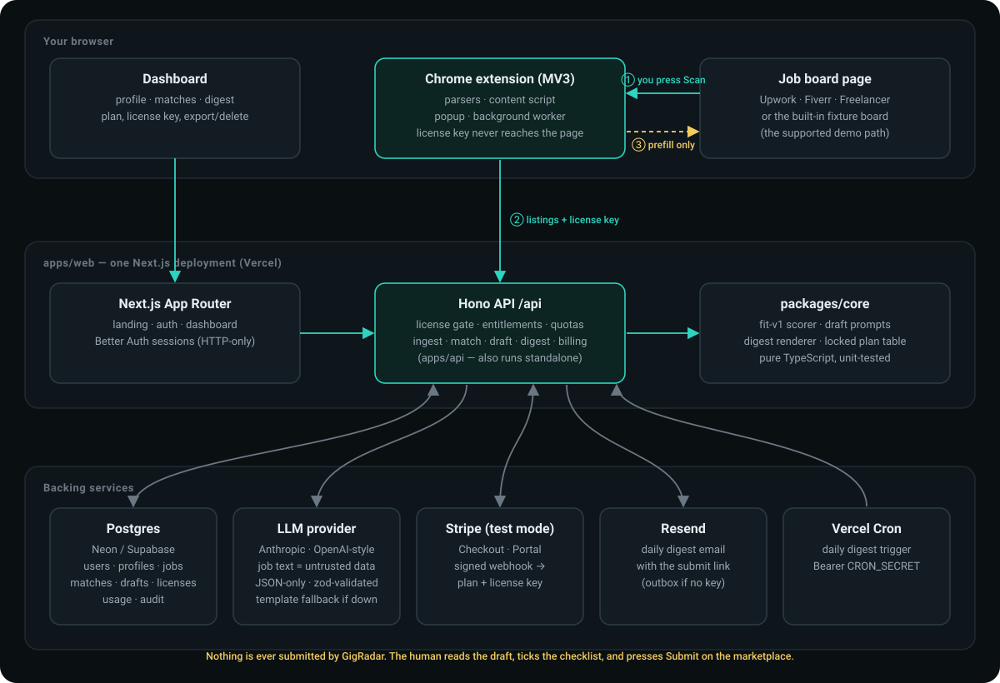
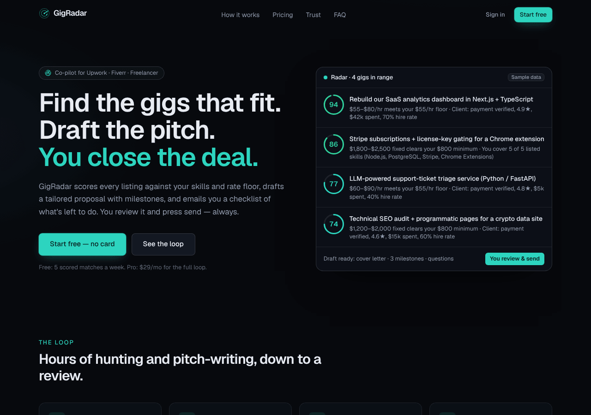
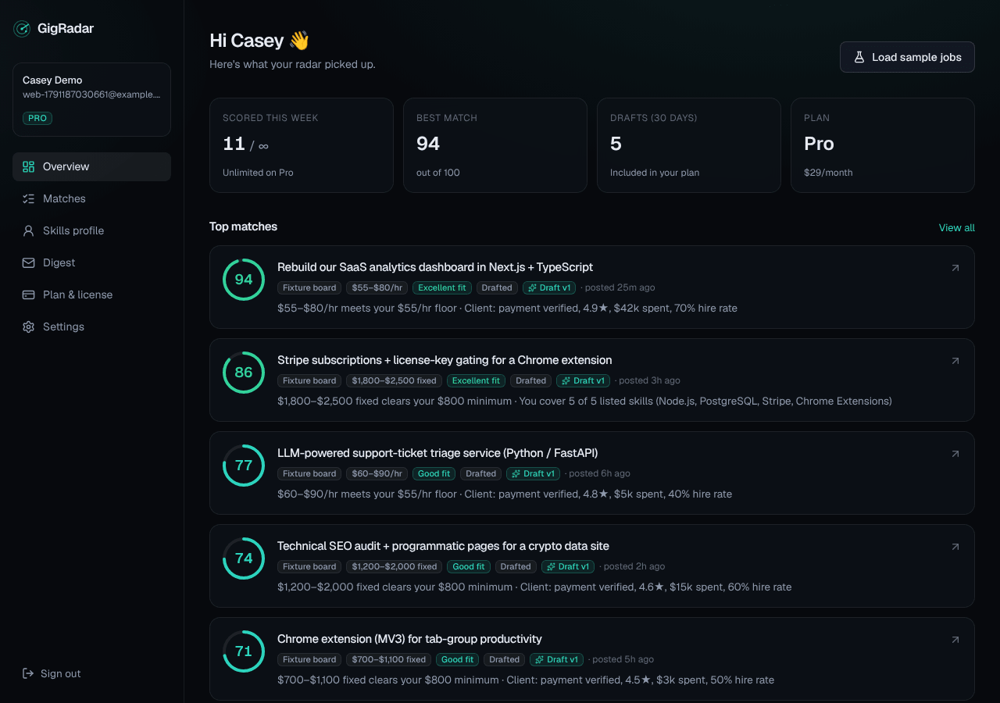
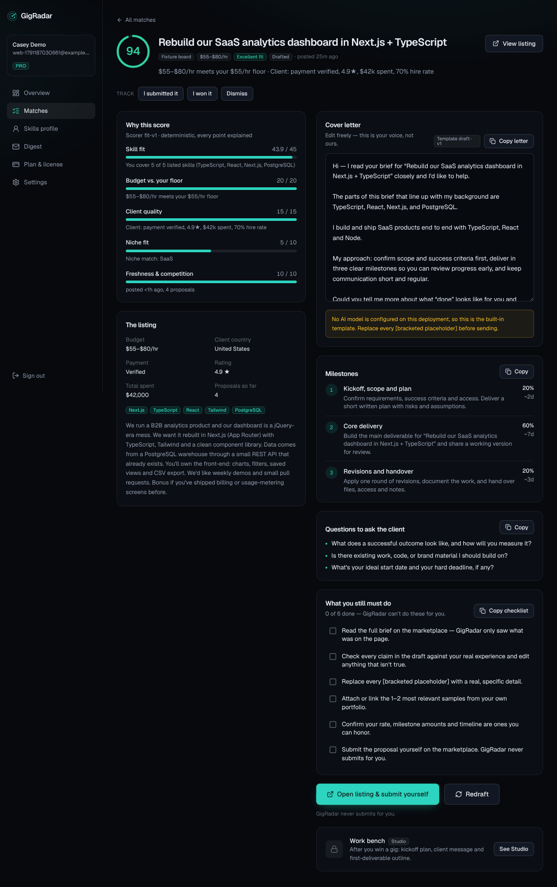
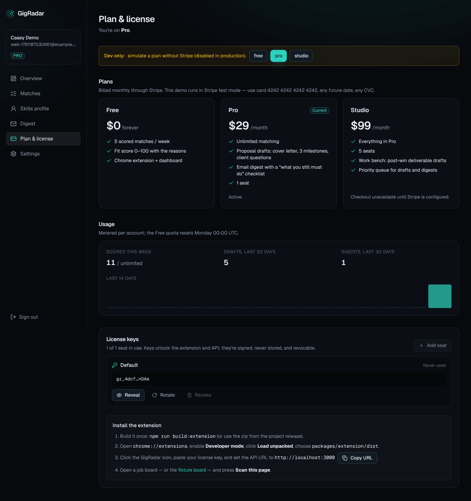
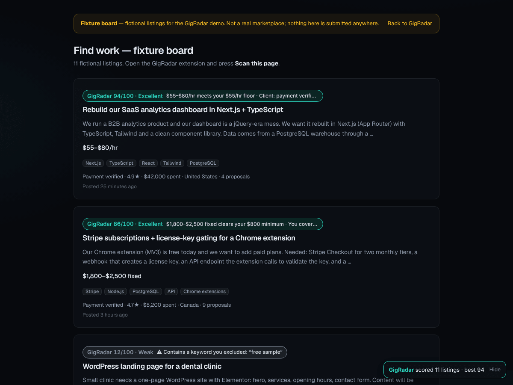
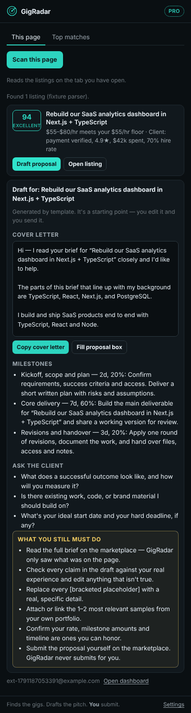
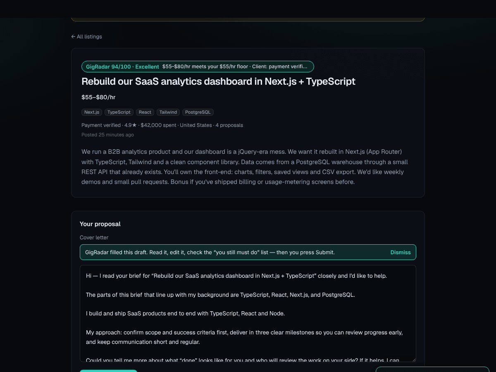

# GigRadar


**Live demo:** https://gig-radar-omega.vercel.app
**GigRadar finds the gigs that fit and drafts the pitch — you close the deal.**

A skill-fit job radar and AI proposal co-pilot for freelancers on Upwork, Fiverr and Freelancer. You tell it what you're good at; a Chrome extension scores the listings you browse (0–100, with the reasons); on a paid plan it drafts the proposal — cover letter, three milestones, questions for the client, and a checklist of *what you still must do* — and emails you a daily digest with a link to submit. **You read it, edit it, and press Submit. GigRadar never submits anything for you.**

Built for the Galuxium Nexus V2 hackathon. Original work, new repository.



## Screenshots

Captured from a local build on the fictional sample data, in template-draft mode (no LLM key configured). Nothing here is a real listing, customer or revenue figure.

| | |
| --- | --- |
|  **Landing** |  **Dashboard** — scored matches, plan, usage |
|  **Match detail** — every point of the score explained, draft, milestones, questions, "what you still must do" |  **Plan & license** — locked pricing, usage, signed license keys, extension install |
|  **Extension** — in-page badges on the built-in fixture board |  **Extension popup** — draft with the mandatory human checklist |
|  **Prefill** — the extension fills the box; the human presses Submit | |

> Live demo: _set after deploy — see [docs/HANDOFF.md](docs/HANDOFF.md)_ · Stripe runs in **test mode** (card `4242 4242 4242 4242`) · Pitch/demo script: [docs/DEMO-SCRIPT.md](docs/DEMO-SCRIPT.md)

---

## Status — what is real and what isn't

| Area | State |
| --- | --- |
| Landing, sign-up/sign-in, skills profile, matches, match detail, digest, billing, settings | Built and exercised end to end (dashboard screenshots + API tests). |
| Fit scorer (`fit-v1`), proposal drafts, injection-hardened prompts, email digest | Built, unit-tested. Drafts use an LLM when a key is configured and a clearly labelled deterministic **template** otherwise. |
| Stripe Checkout → signed webhook → plan + license key → gate on API and extension | Built. The webhook signature path is tested with Stripe's own signing helpers; the full Checkout round-trip needs **your Stripe test keys** and has not been run against Stripe from this repo's CI. A dev-only "simulate plan" switch (disabled in production) covers local demos. |
| Chrome MV3 extension | Built, bundled, and exercised in real Chromium against the built-in fixture board: connect with a license key, scan, in-page badges, Free quota, upgrade, draft, prefill, key rotation. |
| **Parsers for the real Upwork / Fiverr / Freelancer sites** | **Best-effort and unverified.** Their markup is undocumented, changes often, and their terms restrict automation. The selectors in [`packages/extension/src/parsers`](packages/extension/src/parsers) are starting points, and only synthetic markup is tested. The **supported demo path is the built-in fixture board** (`/demo-board`, 11 fictional listings, documented `data-gr-*` markup). Any page that publishes schema.org `JobPosting` JSON-LD also works through a generic parser. |
| Work bench (Studio): kickoff plan and first-deliverable outline | Built (P1). |
| Multi-seat Studio | Seats are license keys on one account (Studio = 5). Not a full team/org model. |
| Deployed instance | Not deployed from this repo's CI — see [docs/DEPLOY.md](docs/DEPLOY.md). |

No fake customers, revenue or screenshots anywhere: every listing in the demo is fictional and labelled as such.

## The loop

1. **Profile.** Skills, niches, hourly floor, excluded keywords, portfolio links, tone.
2. **Radar.** Browse a job board as usual; press **Scan this page** in the extension. Each listing gets a score and the reasons behind it.
3. **Pitch.** *(Pro)* One click drafts a proposal that only uses facts from your profile and inserts `[placeholders]` where it would otherwise invent experience.
4. **Digest.** *(Pro)* A daily email lists your best matches, each with its checklist and a link to open the listing.
5. **You close.** Read, edit, tick the checklist, submit on the marketplace yourself.

### How a score is made (`fit-v1`, deterministic, every point explained)

| Factor | Max | Looks at |
| --- | --- | --- |
| Skill fit | 45 | Overlap between your skills and the listing's tags and text (alias-aware: "node" ≈ "Node.js"). |
| Budget vs. your floor | 20 | Hourly or fixed budget against your rate floor / minimum fixed budget. |
| Client quality | 15 | Payment verified, rating, spend, hire rate — *unknown is scored neutrally, never as bad*. |
| Niche fit | 10 | Your niches in the listing. |
| Freshness & competition | 10 | Age of the posting and proposal count. |

A listing containing one of your **excluded keywords** is capped at 15 and flagged. No ML is involved in scoring: it is reproducible and cheap, so the Free plan can score without an LLM bill.

## Plans (locked)

| | Free | Pro | Studio |
| --- | --- | --- | --- |
| Price | $0 | **$29 / mo** | **$99 / mo** |
| Scored matches | 5 / week | Unlimited | Unlimited |
| Proposal drafts | — | ✓ | ✓ |
| Email digest | — | ✓ | ✓ |
| Seats | 1 | 1 | 5 |
| Work bench (post-win deliverable drafts) | — | — | ✓ |
| Priority queue | — | — | ✓ |

Free is radar only on purpose: it shows what fits; the money is in the part that saves the hours. Plan limits live in one table, [`packages/core/src/plans.ts`](packages/core/src/plans.ts), and are enforced server-side (never in the UI alone). Free usage is metered from the `usage_events` table (Monday 00:00 UTC reset). Drafts also have a fair-use daily cap (Pro 100, Studio 400) to protect LLM spend — an operational limit, not part of the pricing table.

## Monorepo

```
apps/
  web/            Next.js 16 (App Router) — landing, auth, dashboard, fixture job board, and the API mounted at /api
  api/            Hono API + Drizzle/Postgres + Better Auth + Stripe + license gate (runs inside web, or standalone)
packages/
  core/           Pure TypeScript: scorer, draft prompts + validation, digest renderer, plan table, fixtures
  extension/      Chrome MV3 extension: parsers, content script, popup, service worker, esbuild build
docs/
  ARCHITECTURE.md · COMPLIANCE.md · DEPLOY.md · DEMO-SCRIPT.md · SUBMISSION.md · HANDOFF.md
```

## Tech stack

TypeScript 5.9 · Next.js 16 (App Router, Turbopack) · React 19 · Tailwind CSS v4 · Hono · Drizzle ORM · Postgres (Neon/Supabase in production; embedded PGlite for local dev and tests) · Better Auth (email + password, optional GitHub) · Stripe (Checkout, Customer Portal, webhooks) · Resend (digest email) · Anthropic Messages API or any OpenAI-compatible endpoint (drafts) · zod · Vitest · esbuild (extension).

## Data model

Migrations are generated by drizzle-kit and embedded in code, so a deploy needs no CLI step (applied under a Postgres advisory lock on boot).

| Table | Purpose |
| --- | --- |
| `user`, `session`, `account`, `verification` | Better Auth. |
| `profiles` | Skills, niches, excluded keywords, rate floor, portfolio links, tone, digest preferences. One per user. |
| `jobs` | Listings the user captured (source, external id, title, description, budget, skills, client signals). Unique per user + source + external id; a later fuller capture merges in. |
| `matches` | Score, label, per-factor breakdown, red flags, matched/missing skills, status (`new`, `drafted`, `applied`, `won`, `dismissed`), scorer version. |
| `drafts` | Versioned proposal drafts: cover letter, 3 milestones, client questions, "you still must do", `generated_by` and prompt version. |
| `workbench_items` | Studio post-win documents. |
| `subscriptions` | Plan, status, Stripe customer/subscription ids, period end. |
| `licenses` | License key records: id, version, label, last used, revoked. The key itself is **derived** (`gr_<id>_<HMAC>`), never stored. |
| `digests` | Every digest composed (subject, html, text, matches, sent-or-outbox). |
| `usage_events` | Metering for the Free quota and draft caps. |
| `audit_events` | Security events (license rotate/revoke, export, delete…). No foreign key, so `account.deleted` outlives the user. |
| `stripe_events` | Webhook idempotency. |

## API (selection)

Base path `/api`. Authentication is a session cookie (dashboard) or `x-gigradar-license: gr_…` (extension). Mutations made with a cookie must be same-origin.

| Endpoint | Auth | Notes |
| --- | --- | --- |
| `GET /health` | – | Status, DB kind, which integrations are configured. |
| `GET /me` | session / license | User, plan, limits, usage. |
| `GET/PUT /profile` | session | Saving re-scores existing jobs for free. |
| `POST /jobs` | session / license | Ingest up to 50 listings; returns scores; Free quota → `locked: true` once spent. |
| `GET /matches`, `GET/PATCH /matches/:id` | session / license | List, detail with factor breakdown, status. |
| `POST /matches/:id/draft` | session / license | **Pro**: draft. Free gets `402 plan_required`. |
| `POST /matches/:id/workbench` | session | **Studio**. |
| `GET/POST /license`, `…/:id/reveal|rotate`, `DELETE …/:id` | session | Seats are enforced here. |
| `POST /billing/checkout`, `/billing/portal`, `/billing/confirm` | session | Stripe. `confirm` is the success-redirect fallback if the webhook is late. |
| `POST /stripe/webhook` | Stripe signature | Idempotent by event id. |
| `POST /digest/preview`, `/digest/send`; `GET /digests`; `GET /cron/digest` | session / `Bearer CRON_SECRET` | Digest with outbox fallback. |
| `GET /account/export`, `DELETE /account` | session | Export JSON / delete everything (and cancel the Stripe subscription). |

## Run it locally

Requires Node ≥ 20.9.

```bash
npm install
cp .env.example apps/web/.env.local     # optional: the defaults boot with an embedded Postgres and insecure dev secrets
npm run dev                              # http://localhost:3000
```

With no `DATABASE_URL` the API uses embedded Postgres (PGlite). Set `PGLITE_DIR=./.data/pglite` to keep data between restarts. With no LLM key, drafts come from the labelled template; with no Resend key, digests land in the in-app outbox.

**Try the whole loop without touching a marketplace:**

1. Sign up at `/signup`, then press **Load sample jobs** on the Overview page (loads a sample profile and 11 fictional listings).
2. **Plan & license** → in dev, use the *simulate plan* switch (disabled in production) to try Pro. Real upgrades go through Stripe Checkout.
3. Build the extension and load it (below), paste the license key from **Plan & license**, open `/demo-board` and press **Scan this page**.

### The Chrome extension

```bash
GIGRADAR_API_ORIGIN=http://localhost:3000 npm run build:extension   # use your https deployment URL for a real demo
```

Open `chrome://extensions` → enable **Developer mode** → **Load unpacked** → choose `packages/extension/dist`. Click the GigRadar icon, paste your license key, and confirm the API address. Details: [`packages/extension/README.md`](packages/extension/README.md).

### Tests and checks

```bash
npm run typecheck     # all workspaces
npm test              # core (scorer, prompts, digest) · api (auth, licenses, quotas, Stripe webhook, digest) · extension (parsers, prefill)
npm run build         # production build of the web app
```

## Configuration

| Variable | Needed for | Notes |
| --- | --- | --- |
| `DATABASE_URL` | Production | Postgres URL (Neon/Supabase). Production refuses to boot on an in-memory DB without it. |
| `BETTER_AUTH_SECRET`, `LICENSE_SECRET` | Production | 32+ random chars each. Rotating `LICENSE_SECRET` invalidates every key. |
| `APP_URL` | Production | Public origin (also derived from Vercel env). Used for auth callbacks, Stripe redirects and digest links. |
| `STRIPE_SECRET_KEY`, `STRIPE_WEBHOOK_SECRET`, `STRIPE_PRICE_PRO`, `STRIPE_PRICE_STUDIO` | Billing | Use **test** keys. `npm run stripe:setup` creates the products/prices and prints the values. |
| `ANTHROPIC_API_KEY` (+ `ANTHROPIC_MODEL`) or `LLM_API_KEY` + `LLM_BASE_URL` + `LLM_MODEL` | AI drafts | Optional; template fallback otherwise. |
| `RESEND_API_KEY`, `EMAIL_FROM` | Digest email | Optional; outbox fallback otherwise. |
| `CRON_SECRET` | Scheduled digest | Vercel Cron sends it as a bearer token. |
| `GITHUB_CLIENT_ID`, `GITHUB_CLIENT_SECRET` | GitHub sign-in | Optional. |
| `NEXT_PUBLIC_REPO_URL` | Footer link | Optional. |

Full walkthrough (Vercel + Neon + Stripe + Resend): [docs/DEPLOY.md](docs/DEPLOY.md).

## Governance, safety, compliance

GigRadar is built as a co-pilot, not a bot. In short: the extension reads only the page you have open and only when you press Scan (auto-scan is an opt-in setting, off by default); it never stores marketplace credentials or cookies, never messages clients and never submits a proposal — it can *prefill* the proposal box and shows a banner, and the human presses Submit. Job text is treated as untrusted data in every prompt, links in drafts are limited to your own portfolio, and every draft ships with a mandatory human checklist. Users can export or delete everything. Full detail, including known gaps and the marketplace-terms position: [docs/COMPLIANCE.md](docs/COMPLIANCE.md) and the in-app [Privacy & governance](apps/web/src/app/privacy/page.tsx) page.

## What's deliberately not here

No auto-apply, no stealth, no scraping in the background, no account-farming, no fake social proof. The matcher's weights and the draft prompt are in this repository (they are not secret); if you fork this into a product you may want to keep them private.

## License

MIT — see [LICENSE](LICENSE). Not affiliated with or endorsed by Upwork, Fiverr or Freelancer.