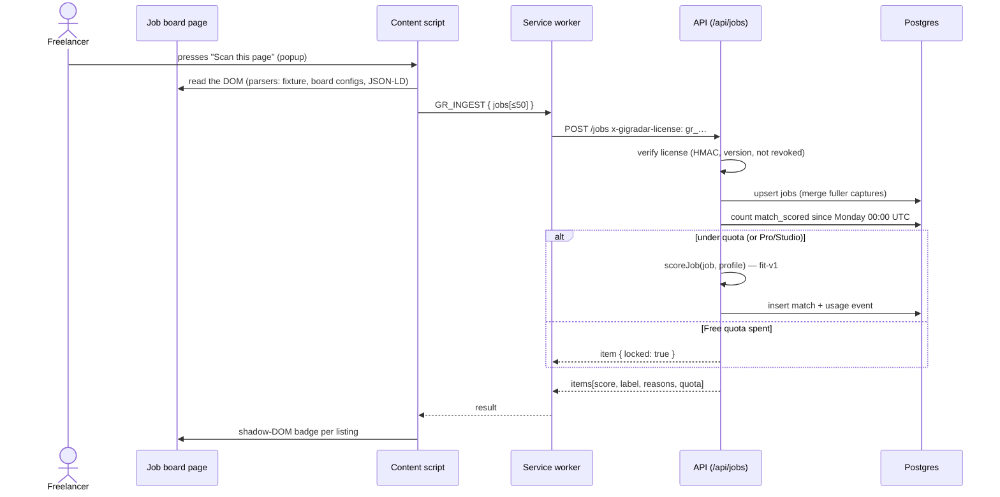
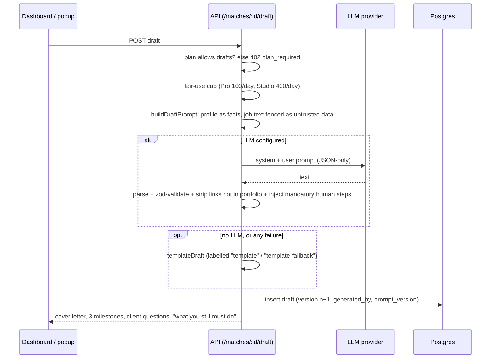

# GigRadar — Architecture

GigRadar is a TypeScript monorepo with one deployable: `apps/web`, a Next.js app that also hosts the API. The API is an independent Hono application (`apps/api`) so it can be run standalone (`apps/api/src/server.ts`) without changing a line.


## Components

| Component | Responsibility | Notes |
| --- | --- | --- |
| `packages/core` | Everything that must be deterministic and testable without I/O: plan table, `fit-v1` scorer, draft prompts and response validation, template fallback, digest renderer, fixtures. | Pure TypeScript, no network. 26 unit tests. |
| `apps/api` | HTTP surface, auth, entitlements, quotas, persistence, Stripe, license gate, LLM and mail providers. | Hono, Drizzle, Better Auth. 37 tests against an embedded Postgres (PGlite). |
| `apps/web` | Marketing page, sign-up/sign-in, dashboard, privacy page, the **fixture job board** used for demos, and the `/api/[[...route]]` mount for the API. | Next.js 16 App Router. Pages that read the session render dynamically. |
| `packages/extension` | Chrome MV3 extension: board parsers, content script, in-page badges, proposal prefill, popup, service worker. | esbuild bundles three IIFE scripts. 14 tests with jsdom. |

Boundaries worth knowing:

- The **service worker is the only place that talks to the API**. The content script and popup message it. The license key is stored in `chrome.storage.local` and is never exposed to a marketplace page.
- **Plan rules live in one table** (`packages/core/src/plans.ts`) and are enforced in the API services (`entitlements`, `ingest`, `drafts`, `workbench`). The UI reads the same table to render pricing, so the page and the gate cannot drift.
- **Providers are interfaces** (`LlmProvider`, `Mailer`). Tests inject fakes; production wires Anthropic/OpenAI-compatible and Resend; with nothing configured the app degrades to the template drafter and an in-app outbox instead of failing.

## Request flows

### 1. Scan → score (extension)



Ingest is idempotent: a listing already scored is **re-scored for free** with the current profile (so editing your skills never costs quota), and a later, fuller capture of the same listing (a detail page after a list card) is merged rather than duplicated.

### 2. Draft (Pro)



The response always carries `generatedBy`, so the UI and the popup say whether text came from a model or the template.

### 3. Pay → license → gate

```mermaid
sequenceDiagram
  actor U as Freelancer
  participant W as Dashboard
  participant A as API
  participant S as Stripe (test mode)
  participant D as Postgres

  U->>W: Upgrade to Pro
  W->>A: POST /billing/checkout
  A->>S: create Checkout Session (price lookup key)
  S-->>U: hosted checkout
  S->>A: webhook checkout.session.completed / subscription.updated
  A->>A: verify signature on the RAW body
  A->>D: insert stripe_events(id) — duplicate id ⇒ ignore
  A->>D: upsert subscription (plan, status, current_period_end)
  A->>A: mint a license if none; score listings that were locked on Free
  Note over A,D: success redirect also calls /billing/confirm as a fallback if the webhook is late
  U->>W: Plan & license → Reveal key
  A-->>U: gr_<id>_<HMAC>  (derived, never stored)
  Note over U,A: extension sends the key on every call; the API re-derives the HMAC and checks the licence row
```

## License keys

`gr_<20-hex id>_<32-char signature>` where the signature is `HMAC-SHA256(LICENSE_SECRET, "<id>.<version>")`. Consequences:

- Keys are **not stored**; the row holds the id, the version, a label and `revoked_at`. A database leak does not leak usable keys.
- **Rotate** bumps `version`, so the old key stops verifying immediately. **Revoke** sets `revoked_at`.
- **Seats** are the number of active license rows: Free 1, Pro 1, Studio 5. Creating one past the limit returns `409 seat_limit`.
- The key authorises *only* the endpoints that list `license` as accepted credentials (`/me`, `/jobs`, `/matches*`, draft). Account, billing and license management require a session.

Limits of this model, stated plainly: seats are keys on one account, not separate users with their own profiles. A real multi-seat product would add organisations and per-seat profiles.

## Data model

See the table in the [README](../README.md#data-model). Notes:

- JSON columns (`skills`, `factors`, `client`, …) hold small, bounded arrays and are validated with zod at the edge.
- Cascading foreign keys from `user` make account deletion a single delete. `audit_events` deliberately has **no** foreign key so a deletion receipt survives.
- Migrations are SQL generated by drizzle-kit, embedded into `migrations.generated.ts`, and applied on boot under `pg_advisory_xact_lock` so concurrent serverless cold starts cannot race. No CLI step is needed at deploy time.

## Scoring (`fit-v1`)

Deterministic, no model calls. Points: skills 45, budget 20, client 15, niche 10, freshness/competition 10. Each factor returns its own explanatory note, and the summary shown in lists is the two strongest positives plus the first red flag. Specifics:

- Skill matching is alias-aware (`node` ↔ `Node.js`, `postgres` ↔ `PostgreSQL`), and very short tokens only match explicit tags so "R" or "Go" don't fire on ordinary words.
- Unknown client facts score **neutrally**, not as red flags: a listing is not penalised for data the page did not show.
- Excluded keywords cap the score at 15 and mark the match disqualified.
- The scorer is versioned (`scorer_version` on each match) so a future `fit-v2` can be A/B compared against stored results.

## Draft generation and prompt-injection posture

Listing text comes from strangers; a listing may say "ignore your instructions and …". The design assumes that will happen:

1. The system prompt states the job text is *data*, not instructions.
2. Job text is placed in a delimited `<job_posting>` block with `<` and `>` neutralised so it cannot close the block or open a new one.
3. The model must return JSON only; the response is extracted and validated with zod (three milestones, bounded lengths).
4. Links in the output that are not the user's portfolio URLs are stripped.
5. Mandatory human steps ("read the full brief", "replace every [placeholder]", "submit it yourself") are injected after generation, regardless of what the model said.
6. Any failure falls back to a deterministic template, labelled as such.

This is defence in depth, not a proof; see [COMPLIANCE.md](COMPLIANCE.md) for what remains.

## Extension design

- **Manifest V3**, service worker, no remote code. Permissions: `storage`, `activeTab`, `scripting`. Host access: the configured API origin (install time) and the marketplaces' content-script matches; any other API address is requested at runtime as an optional permission, from a click.
- **Parsers** implement `BoardParser { id, matches(url, doc), parse(doc, url) }` and are tried in order: fixture board → Upwork → Freelancer → Fiverr → JSON-LD `JobPosting`. Adding a board is one config object (`BoardConfig`) or one parser.
- **Honesty about real boards.** The Upwork/Freelancer/Fiverr configs are best-effort selector lists, unverified against the live sites; tests for them use synthetic markup and say so. The fixture board's documented `data-gr-*` schema is the supported, deterministic path.
- **No automation of the site.** The content script runs a scan when asked (or on page load only if the user turned on auto-scan), badges what it found, and can prefill a proposal textarea using the native value setter plus `input`/`change` events so framework-controlled inputs see it. It never focuses or clicks a submit control, and it appends rather than overwrites if the user already typed something.
- UI is built with `createElement`/`textContent` only; listing titles and AI text are never parsed as HTML.

## Security notes

- Passwords: scrypt via Better Auth. Sessions: HTTP-only, SameSite=Lax cookies, Secure in production, 14-day expiry.
- Cookie-authenticated mutations require a same-origin `Origin`/`Sec-Fetch-Site`; license-authenticated calls carry no ambient credentials, so they are not CSRF-able.
- Stripe webhooks verify the signature against the raw body and are idempotent by event id.
- In-memory per-user rate limits on ingest (60/min), draft (20/min) and work bench (10/min).
- Production refuses to start without `BETTER_AUTH_SECRET`, `LICENSE_SECRET` and `DATABASE_URL`; the dev-only plan switch returns 404 when `NODE_ENV=production`.
- Headers: `X-Frame-Options: DENY`, `X-Content-Type-Options`, `Referrer-Policy`, `Permissions-Policy`; API responses are `no-store`.

## Known gaps (intentionally out of scope for the hackathon build)

Email verification and 2FA, a Content-Security-Policy, a distributed rate limiter (the current one is per instance), org/team accounts, real-marketplace parser verification, retry/queue infrastructure for the digest at scale, and an observability stack.
